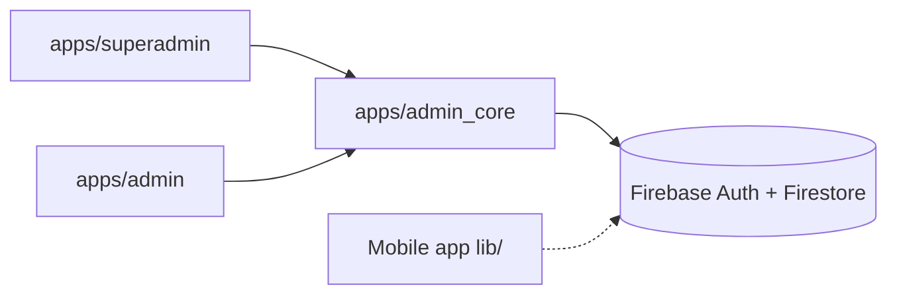
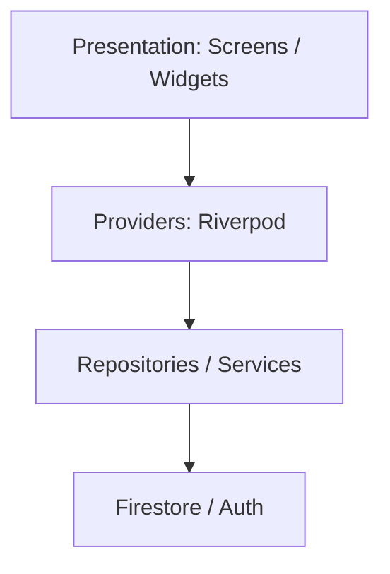
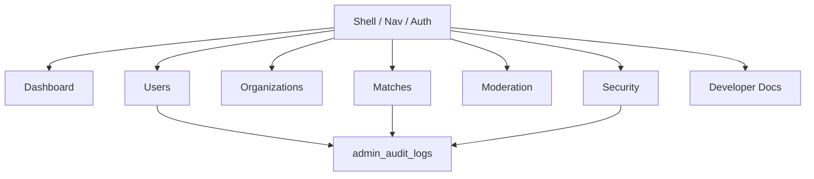
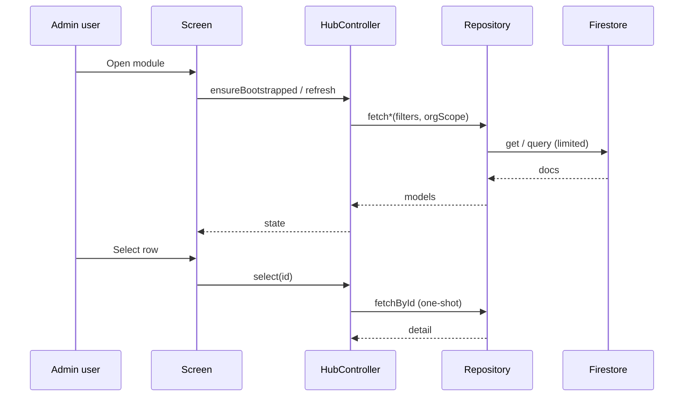

# Architecture Overview

## Purpose

Explain how CrickFlow Admin is structured so new engineers can navigate code, data, and permissions safely.

## Overview

CrickFlow Admin is a **multi-app Flutter Web** system sharing one package:



| App | Audience | Host (target) |
|-----|----------|---------------|
| `superadmin` | Platform owners | `superadmin.crickflow.app` |
| `admin` | Organization admins | `admin.crickflow.app` |
| `admin_core` | Shared foundation | — |

Mobile (`lib/`) shares the Firebase **project** but **not** the admin codebase. Admin uses additive collections (`admin_*`) and limited writes on mobile collections.

## Why this architecture

1. **Isolation** — Admin bugs cannot ship inside the mobile binary.
2. **Shared UX** — One design system + Riverpod patterns in `admin_core`.
3. **Panel gates** — Super vs Org enforced at session + route + query scope.
4. **Additive data** — Prefer new collections/fields; avoid mobile schema breaks.
5. **Defense in depth** — Client permissions + Firestore rules + (future) claims.

## Application layers



| Layer | Responsibility | Location |
|-------|----------------|----------|
| Presentation | UI, navigation, forms | `features/*/presentation` |
| Providers | UI state, orchestration | `features/*/providers` |
| Domain models | Typed entities / enums | `features/*/models`, `models/` |
| Data | Firestore I/O, mapping | `features/*/data`, `services/` |
| Core | Theme, router, cache, l10n, a11y | `core/` |
| Shared | Reusable `Cf*` widgets | `shared/widgets` |

## Clean Architecture (practical)

We follow a **pragmatic** Clean Architecture:

- **Inward dependencies**: UI → providers → repositories → Firebase.
- **No business rules in widgets** beyond formatting and validation UX.
- **Repositories** own query shape, limits, and audit logging calls.
- **Providers** own loading/error/selection state; dispose timers/controllers.

## Module relationships



Modules communicate via:

- **Shared providers** (`adminSessionProvider`, permissions)
- **Shared services** (`AuditLogger`, `AuthService`)
- **GoRouter** navigation (`AdminRoutePaths`)
- **Firestore** as source of truth (not cross-module method calls)

## Data flow (typical list + detail)



**Realtime policy:** permanent listeners only where required (auth session, support messages, live match/broadcast detail). Prefer `FutureProvider` / one-shot `get()` elsewhere ([WEB_ADMIN_PRODUCTION.md](../WEB_ADMIN_PRODUCTION.md)).

## Dependency flow

```
superadmin/admin
  → crickflow_admin_core
    → flutter_riverpod, go_router
    → firebase_auth, cloud_firestore
    → intl, google_fonts, shared_preferences, fl_chart
```

Do **not** add mobile packages into admin unless required for web.

## Best practices

- Scope Org Admin queries by `organizationId`.
- Register new routes in `AdminRoutePermissions` + nav + Firestore rules together.
- Prefer additive collections under `AdminCollections`.
- Keep secrets out of docs and client bundles.

## Common mistakes

- Treating client `PermissionGate` as security (rules must match).
- Attaching `.snapshots()` on every detail panel.
- Writing to mobile-owned fields without an additive strategy.
- Putting Super-Admin-only modules in Org Admin router/nav.

## Future improvements

- Custom claims mirroring `admin_roles` for rule simplification.
- Stricter `admin_audit_logs` org-scoped rules + composite indexes.
- Package boundary tests for panel route exclusion.
