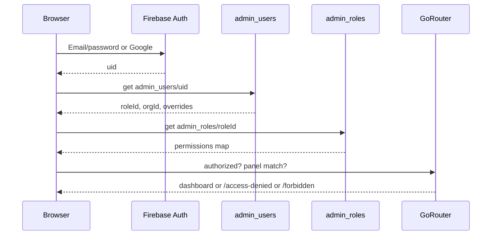

# Authentication Guide

## Purpose

Document how admins sign in, how roles/permissions apply, and how routes are protected.

## Overview



## Authentication flow

1. Firebase Auth (email/password or Google). No anonymous admin.
2. Persistence: Remember me → `LOCAL`, else `SESSION` (see `AuthService` / login screen).
3. Load `admin_users/{uid}` — must exist and `isActive == true`.
4. Resolve `admin_roles/{roleId}` (+ optional `permissionOverrides`).
5. Panel gate:
   - Super Admin app ↔ `roleId == superAdmin`
   - Org Admin app ↔ `roleId == admin` **and** non-empty `organizationId`
6. Force token refresh for future custom claims: `getIdToken(true)`.

## Role management

Roles live in `admin_roles`. Defaults merge under Firestore maps so new `AdminPermission` enum values appear for Super Admin (`all`) and role templates.

Provision Super Admin: `scripts/provision-super-admin.cjs` (requires local credentials — never commit them).

## Permission validation

| Layer | Mechanism |
|-------|-----------|
| Router | `adminAuthRedirect` + `AdminRoutePermissions.isAllowed` |
| Widget | `PermissionGate` / `PermissionGateAny` |
| Data | Org-scoped repository filters |
| Rules | Firestore `isSuperAdminUser()` / `isActiveAdminUser()` / org match |

Client gates are **UX**. Rules enforce security.

## Session handling

- `adminSessionProvider` exposes `AdminSessionStatus` (loading, unauthenticated, authorized, wrongPanel, …).
- Loading should not flash Access Denied (pending stream coordination).
- Logout signs out Auth and writes audit `auth.logout` when possible.

## Protected routes

```dart
// admin_route_permissions.dart
AdminRoutePaths.users: AdminPermission.canManageUsers,
// any-of example:
AdminRoutePaths.reports → canViewReports | canModerateCommunity | canManageDiscover
```

Missing permission → `/forbidden`. Wrong panel / inactive → `/access-denied`.

## Best practices

- Prefer `isAllowed` over single `requiredFor` when multiple permissions grant access.
- Never put secrets in `admin_users` documents.
- Org Admin must not see platform-only SOC/DevOps tools.

## Common mistakes

- Checking only UI gates when adding destructive actions.
- Forgetting Google authorized domains for new hosts.
- Assuming mobile `users.role` authorizes admin panels (it does not).

## Future improvements

- Custom claims sync from `admin_roles`.
- Session registry / forced logout across devices (SOC hooks exist).
