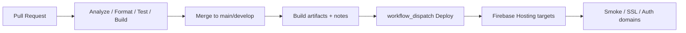

# CI/CD & Environment Management

## Purpose

Enterprise delivery architecture for CrickFlow **Admin** (`apps/admin`, `apps/superadmin`, `apps/admin_core`).

**Non-negotiables**

- No automatic production deploys on `git push`
- No secrets in git
- Do not modify mobile `public/` Hosting via Admin pipelines
- Existing `firebase.json` Hosting for scorecard/privacy stays untouched

## Overview



| Workflow | File | Trigger | Deploys? |
|----------|------|---------|----------|
| Admin PR Validation | `.github/workflows/admin-pr.yml` | PR to main/develop/staging | No |
| Admin Main Pipeline | `.github/workflows/admin-main.yml` | Push main/develop | No |
| Admin Deploy (manual) | `.github/workflows/admin-deploy.yml` | `workflow_dispatch` only | Yes (manual) |
| Admin Security Scan | `.github/workflows/admin-security.yml` | PR / schedule | No |
| Admin Release | `.github/workflows/admin-release.yml` | `workflow_dispatch` | No (GitHub Release only) |

Mobile CI remains `.github/workflows/flutter.yml` (root app).

## Branch strategy

| Branch | Role |
|--------|------|
| `main` | Production-ready history; protected |
| `develop` | Integration |
| `staging` | Optional pre-prod branch |
| `feature/*` | Features → PR into `develop` or `main` |
| `hotfix/*` | Urgent fixes from `main` |
| `release/*` | Release hardening |

### Protection (configure in GitHub Settings)

For `main` (and optionally `develop`):

- Require pull request before merge
- Require status checks: Admin PR Validation jobs + Security Scan
- Require approvals (recommended: 1+)
- Do not allow force pushes
- Restrict who can run **Admin Deploy** to maintainers

## Environments

Matrix: [`config/admin/environments.yaml`](../../config/admin/environments.yaml)

| Env | `ADMIN_ENV` | Domains (target) |
|-----|-------------|------------------|
| Development | `development` | localhost |
| Testing | `testing` | `*-test.crickflow.app` / preview channels |
| Staging | `staging` | `*-staging.crickflow.app` |
| Production | `production` | `admin.crickflow.app`, `superadmin.crickflow.app` |

Compile-time switch:

```dart
AdminEnvConfig.environment; // AdminBuildEnvironment
AdminEnvConfig.displayBanner;
```

```bash
flutter build web --release \
  --dart-define=ADMIN_ENV=staging \
  --dart-define=ADMIN_VERSION=0.1.0 \
  --dart-define=ADMIN_BUILD_NUMBER=$GITHUB_RUN_NUMBER \
  --dart-define=ADMIN_GIT_SHA=$GITHUB_SHA
```

**Never mix** production Hosting sites with development dart-defines when deploying.

## Firebase Hosting (Admin only)

Separate config: [`firebase.admin.json`](../../firebase.admin.json)

Does **not** alter root [`firebase.json`](../../firebase.json) (mobile scorecard Hosting).

1. Create Hosting sites in Firebase Console (e.g. `crickflow-admin`, `crickflow-superadmin`).
2. Apply targets (see [`firebase.admin.rc.example`](../../firebase.admin.rc.example)).
3. Deploy manually:

```bash
firebase deploy --only hosting:admin,hosting:superadmin \
  -c firebase.admin.json \
  --project crickflow-b06bc
```

Or use GitHub **Admin Deploy (manual)** with Environment secrets.

Preview channels (future):

```bash
firebase hosting:channel:deploy pr-123 -c firebase.admin.json --only admin
```

## Semantic versioning

- Canonical version file: [`apps/VERSION`](../../apps/VERSION) (`MAJOR.MINOR.PATCH`)
- Keep `apps/admin/pubspec.yaml` and `apps/superadmin/pubspec.yaml` in sync when cutting releases
- CI build number = `github.run_number` → `version+build`
- Release workflow tags `vX.Y.Z` and generates notes

## Quality gates

Local:

```powershell
.\scripts\ci\admin-quality.ps1
```

CI (required on PR):

1. `dart format --set-exit-if-changed`
2. `flutter analyze --fatal-infos`
3. `flutter test` (admin_core)
4. `flutter build web` (both apps)
5. Dependency review (high+)
6. Gitleaks secret scan

DevOps Center mirrors gates under **Quality Gates** (including CI rows). Toggle after verifying — never auto-flip from the client.

## Secrets (GitHub)

| Secret / Var | Purpose |
|--------------|---------|
| `FIREBASE_SERVICE_ACCOUNT` | Env-scoped JSON for Hosting deploy |
| `FIREBASE_SERVICE_ACCOUNT_STAGING` | Optional CI metadata writer |
| `vars.FIREBASE_PROJECT_ID` | Override project id |
| `vars.ADMIN_CI_METADATA_ENABLED` | `true` to write build docs to Firestore |

Never commit service accounts. Rotate if exposed.

## Rollback

- Firebase Hosting → Release history → **Rollback** (manual)
- Record event in DevOps **Rollback Center** / timeline (metadata only)
- **No automatic rollback** from Actions or the Admin UI

## Testing architecture (prepared)

| Layer | Location | Status |
|-------|----------|--------|
| Unit | `apps/admin_core/test/` | Active in CI |
| Widget | `apps/*/test/` | Add incrementally |
| Integration | `apps/*/integration_test/` | Architecture ready |
| Golden | future | Architecture ready |
| Smoke | post-deploy checklist | Manual |

## Notifications (future)

Hooks for Slack/Discord/Email on workflow failure — not implemented. Use GitHub Actions native notifications for now.

## Monitoring after deploy

1. Hosting URL loads
2. SSL valid
3. Auth authorized domains include custom domain
4. Login as Super Admin / Org Admin
5. Firestore rules still permit expected reads
6. DevOps Center version / timeline updated (if metadata enabled)

## Developer workflow

1. `feature/*` branch from `develop` or `main`
2. Open PR → Admin PR Validation must pass
3. Merge → Main pipeline builds artifacts
4. Bump `apps/VERSION` on release PRs
5. Run **Admin Release** (optional tag)
6. After QA, run **Admin Deploy (manual)** with confirm for production
7. Smoke test; update DevOps quality gates

## Future platforms

This layout is compatible with Google Cloud Build, Cloud Deploy, Docker, Kubernetes, and Terraform: treat `firebase.admin.json` + dart-defines + artifact folders as the contract; swap the runner without redesigning apps.

## Related

- [deployment.md](deployment.md)
- [environments.md](environments.md)
- DevOps Center UI: `/devops` (Super Admin)
- [WEB_ADMIN_PRODUCTION.md](../WEB_ADMIN_PRODUCTION.md)
