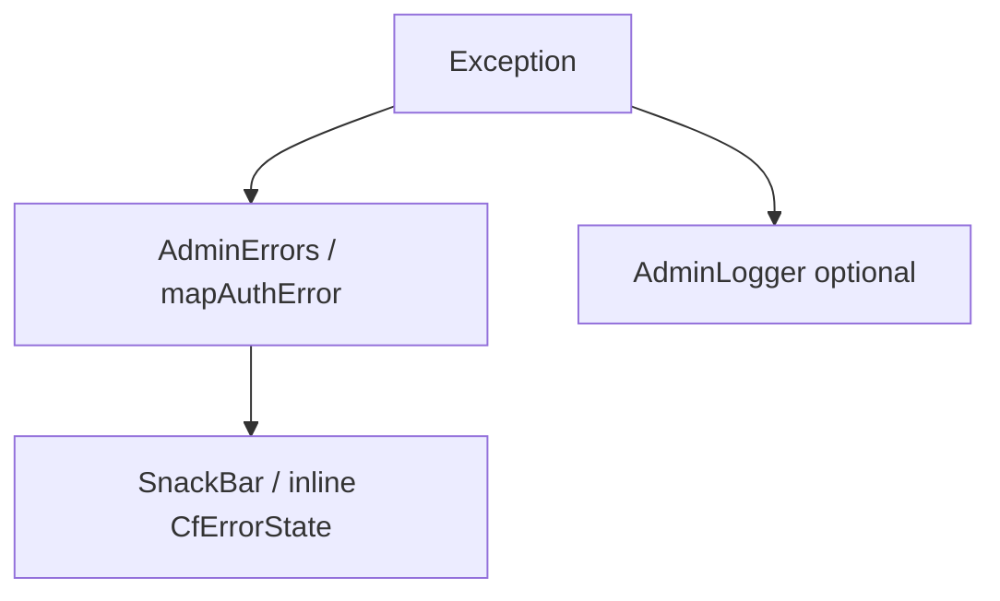

# Error Handling

## Purpose

Standardize how admin surfaces failures without leaking internals.

## Overview



## Categories

| Category | Examples | UX |
|----------|----------|-----|
| Network | offline, timeout | Retry CTA + `errorsNetwork` / `errorsTimeout` |
| Firestore | permission-denied, not-found, index required | Friendly copy; log details |
| Auth | wrong-password, popup-closed | Inline on login |
| Storage | unauthorized, quota | Support message |
| Unexpected | cast errors | `errorsUnexpected` — do not show stack traces to users |

## Retry strategy

- User-triggered refresh on hubs (`RefreshIndicator` / toolbar refresh).
- Debounced search — do not retry loops on every keystroke.
- Avoid automatic infinite retries on permission-denied.

## Implementation tips

```dart
if (!mounted) return;
setState(() => _error = context.l10n.errorsNetwork);
```

Use `context.mounted` after async gaps in widgets; `mounted` in State.

## Best practices

- Prefer localized strings (`context.l10n.errors*`).
- Audit failed privileged actions when useful.
- Never toast raw `e.toString()` in production UX (dev logger OK).

## Common mistakes

- Swallowing errors with empty `catch (_) {}` on critical paths.
- setState after dispose.

## Future improvements

- Central error code enum shared with support runbooks.
- Crash reporting hook (e.g. Crashlytics) for web if adopted.
