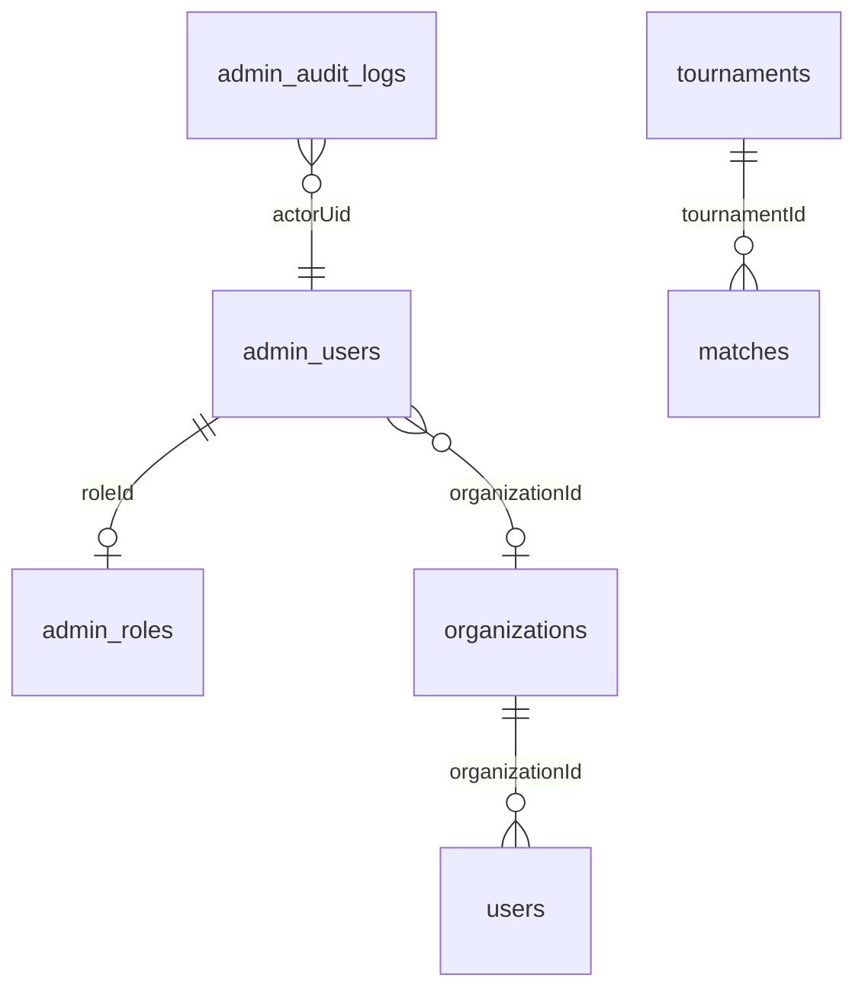

# Firestore Documentation

## Purpose

Document admin-related Firestore collections, relationships, queries, and rules strategy.

## Overview

Admin shares project **`crickflow-b06bc`** with mobile. Prefer **additive** collections (`admin_*`) and additive fields on mobile docs.

Canonical list: `AdminCollections` in `apps/admin_core/lib/core/constants/admin_collections.dart`.

## Core admin collections

| Collection | Purpose | Typical access |
|------------|---------|----------------|
| `admin_users` | Admin profiles by Auth uid | Auth bootstrap |
| `admin_roles` | Permission maps | Auth + Security Center |
| `admin_audit_logs` | Immutable action trail | Audit / SOC |
| `organizations` | Canonical orgs | Super Admin CRUD |
| `admin_platform_settings` | Global settings singleton | Super Admin |
| `admin_feature_flags` | Feature flags | Settings |
| `admin_notification_*` | Campaigns / templates / segments | Notifications hub |
| `admin_ad_*` / `admin_admob_config` / `admin_sponsored_content` | Ads manager | Ads hub |
| `admin_security_*` | SOC alerts, blocks, IPs, backups metadata | Security |
| `admin_devops_*` | Release / rollout metadata | DevOps (Super only) |
| `admin_continuity_*` | Backup / restore / migration metadata | Continuity (Super only) |
| `admin_cms_*` / support / AI ops collections | Respective hubs | Per module |

## Mobile collections (admin read / limited write)

`users`, `teams`, `tournaments`, `matches`, `grounds`, `community_posts`, `opportunity_posts`, `*_reports`, `chats` (metadata only), `notifications` (monitor), `home_promotions`.

**Never** store FCM tokens, OAuth secrets, or RTMP keys in admin docs/UI.

## Relationships



## Naming conventions

- Collections: `snake_case`, admin-owned prefix `admin_`.
- Fields: `camelCase` in maps (`organizationId`, `createdAt`).
- Timestamps: Firestore `Timestamp`; store UTC.
- Soft delete: prefer `deletedAt` / flags over hard delete when mobile depends on history.

## Queries & limits

- Use `AdminQueryLimits` / scan caps (e.g. grounds catalog).
- Client-side filter when composite indexes are missing — document the cost.
- Prefer `limit()` always.

### Example (conceptual)

```dart
final snap = await firestore
    .collection(AdminCollections.users)
    .orderBy('updatedAt', descending: true)
    .limit(AdminQueryLimits.pageSize)
    .get();
```

## Indexes

Deploy indexes via `firestore.indexes.json` when adding compound queries. If a query fails with a link, add the index — do not widen client scans silently without documenting.

## Security rules

See root `firestore.rules`:

- Helpers: `isActiveAdminUser()`, `isSuperAdminUser()`, `isOrgAdminUser()`, `adminUserData()`.
- Super Admin: broad admin collection access.
- Org Admin: org-scoped where fields exist.
- Audit create: actor must match `request.auth.uid`; no update/delete.

**Known follow-up:** tighten `admin_audit_logs` list reads with org `where` + indexes ([WEB_ADMIN_QA_REPORT.md](../WEB_ADMIN_QA_REPORT.md)).

## Example structures (sanitized)

### `admin_users/{uid}`

```json
{
  "email": "admin@example.com",
  "roleId": "admin",
  "organizationId": "org_abc",
  "isActive": true,
  "displayName": "Alex Admin",
  "permissionOverrides": {}
}
```

### `admin_audit_logs/{id}`

```json
{
  "action": "users.suspend",
  "actorUid": "uid_…",
  "actorEmail": "admin@example.com",
  "targetUid": "user_…",
  "organizationId": "org_abc",
  "timestamp": "<Timestamp>",
  "metadata": {}
}
```

## Future expansion

- New hubs → new `admin_<domain>_*` collections + rules block + `AdminCollections` entry.
- Avoid renaming mobile collections.
- Plan indexes before shipping compound filters to production.

## Best practices

- Immutable audit logs.
- Mask IPs / secrets in SOC UI.
- Document every new collection in this file and IMPLEMENTATION_STATUS.

## Common mistakes

- Relying on client filters alone for security.
- Unbounded `get()` without `limit`.
- Writing passwords or API keys into Firestore.
