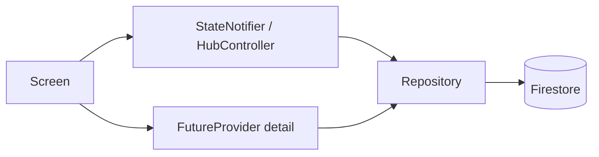

# State Management Guide

## Purpose

Explain Riverpod usage across CrickFlow Admin.

## Overview

Riverpod is the single state layer. Typical hub module:



## Provider types

| Type | Use |
|------|-----|
| `Provider` | Services, repositories, derived checkers |
| `StateProvider` | Simple UI flags (sidebar collapse, theme) |
| `StateNotifierProvider` | Hub list/filter/selection controllers |
| `FutureProvider` / `autoDispose` | One-shot detail loads |
| `StreamProvider` | Auth; rare live surfaces only |

## Dependency injection

```dart
final usersRepositoryProvider = Provider((ref) => UsersRepository());

final usersListControllerProvider =
    StateNotifierProvider<UsersListController, UsersHubState>((ref) {
  return UsersListController(ref);
});
```

Host apps override:

```dart
adminAppTypeProvider.overrideWithValue(AdminAppType.superAdmin),
navSectionsProvider.overrideWithValue(buildSuperAdminNav()),
```

## Repositories

- Construct with optional `FirebaseFirestore` for tests.
- Apply `AdminQueryLimits` and org filters.
- Call `AuditLogger` after mutations.
- Prefer `get()` over `snapshots()` unless realtime is required.

## Best practices

- Keep hub state immutable (`copyWith`).
- Debounce search (≈350ms) with `Timer` cancelled in `dispose`.
- `autoDispose` detail providers when panels close.
- Do not store BuildContext in notifiers.

## Common mistakes

- Permanent listeners on every table refresh.
- Controllers created in `build`.
- Reading `ref` after dispose without guards.

## Future improvements

- Codegen (`riverpod_generator`) if the team adopts it consistently.
- Provider graph diagram in CI.
