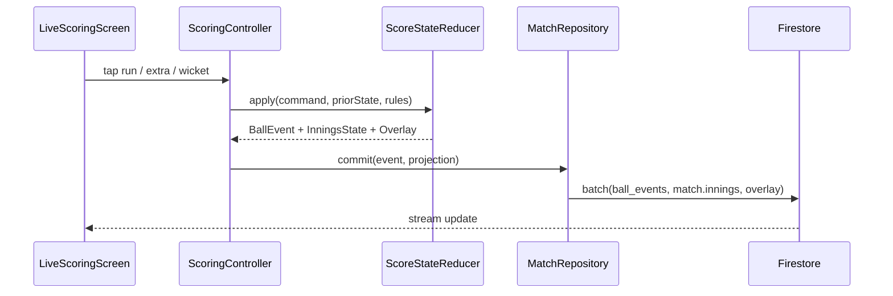

# CrickFlow Scoring Engine — Production Architecture

**Status:** Living document (extends existing implementation)  
**Last updated:** May 2026  
**Audience:** Flutter engineers, Firebase architects, scoring QA  

**Related:** [BALL_EVENT_ARCHITECTURE.md](BALL_EVENT_ARCHITECTURE.md) · [FIREBASE_SCHEMA.md](FIREBASE_SCHEMA.md) · [IMPLEMENTATION_STATUS.md](IMPLEMENTATION_STATUS.md) · [DESIGN_SYSTEM.md](DESIGN_SYSTEM.md)

---

## Non‑negotiables (read first)

| Rule | Meaning |
|------|---------|
| **Keep existing scoring UI** | `LiveScoringScreen`, keypad, extras row, OUT, UNDO, shortcuts — same one-handed flow |
| **Extend, don’t replace** | `ScoringEngine`, `MatchRepository`, `BallEventModel` are the base; refactor in place |
| **Event log is truth for undo** | `matches/{id}/ball_events` + replay; denormalized `innings[]` is a **projection** for speed |
| **Rules are per-match** | `MatchRulesModel` — no hardcoded 6-ball / 20-over assumptions in reducers |

**Current UI entry:** `lib/features/scoring/presentation/live_scoring_screen.dart`  
**Current engine:** `lib/domain/services/scoring_engine.dart`  
**Current persistence:** `lib/data/repositories/match_repository.dart`

---

## 1. Complete scoring engine architecture

### 1.1 Layered design

```
┌─────────────────────────────────────────────────────────────────┐
│  Presentation (KEEP)                                            │
│  live_scoring_screen · keypad · players_strip · extra_dialogs   │
└────────────────────────────┬────────────────────────────────────┘
                             │ BallCommand / BallEventInput
┌────────────────────────────▼────────────────────────────────────┐
│  Application                                                    │
│  ScoringController (Riverpod) · sequence · optimistic UI      │
└────────────────────────────┬────────────────────────────────────┘
                             │
┌────────────────────────────▼────────────────────────────────────┐
│  Domain                                                         │
│  MatchAggregate · InningsAggregate · ScoreStateReducer          │
│  UndoStateManager · CommentaryEngine · PartnershipEngine        │
│  InningsCompletionPolicy · MatchCompletionPolicy              │
└────────────────────────────┬────────────────────────────────────┘
                             │
┌────────────────────────────▼────────────────────────────────────┐
│  Infrastructure                                                 │
│  MatchRepository · FirebaseSyncManager · OfflineEventQueue    │
│  OverlayProjector · PublicScorecardSync · HighlightClassifier │
└─────────────────────────────────────────────────────────────────┘
```

### 1.2 Aggregates (target)

| Aggregate | Responsibility | Today |
|-----------|----------------|-------|
| **MatchAggregate** | Teams, rules, status, innings index, winner | `MatchModel` |
| **InningsAggregate** | Legal balls, score, lineup, free hit, partnerships | `InningsModel` + engine |
| **BallEvent** | Immutable fact of one scoring action | `BallEventModel` |
| **OverSummary** | Derived list of events per over | `ScoringDisplayUtils.currentOverEvents` |
| **ScoreProjection** | Overlay + public scorecard | `OverlayStateModel` |

### 1.3 Hybrid event sourcing (recommended)

**Today:** dual-write (event + mutated `innings[]`).  
**Target:** **write event first → reduce → write projection** (same UX latency).



**Invariant:** `reduce(replay(allEvents)) === reduce(lastProjection)` for every innings.

---

## 2. Reducer / state management flow

### 2.1 Command → event → state

```dart
// Target API (evolve from BallEventInput)
sealed class BallCommand {}

final class RecordRuns extends BallCommand { final int runs; }
final class RecordWide extends BallCommand { final int additionalRuns; }
final class RecordNoBall extends BallCommand {
  final int additionalRuns;
  final NoBallRunsMode mode;
}
// ... bye, legBye, wicket, penalty, undo

class ScoreStateReducer {
  ReduceResult apply({
    required MatchAggregate match,
    required BallCommand command,
    required int nextSequence,
  });
}

class ReduceResult {
  final BallEvent event;           // immutable
  final InningsState innings;      // derived
  final OverlayState overlay;      // derived
  final List<DomainEffect> effects; // e.g. endOver, inningsComplete
}
```

### 2.2 Riverpod wiring (keep screen, thin controller)

| Provider | Role |
|----------|------|
| `matchProvider(matchId)` | Match projection (existing) |
| `ballEventsProvider(matchId)` | Event log (existing) |
| `scoringControllerProvider(matchId)` | Sequence, pending command, debounce |
| `derivedInningsProvider` | Optional: pure replay for debug |

**Rule:** UI reads `match.currentInnings` for display; debug builds can compare with `replay(events)`.

### 2.3 Existing reducer location

Migrate `ScoringEngine._applyEventToInnings` + `_buildEvent` → `ScoreStateReducer` in:

`lib/domain/scoring/score_state_reducer.dart` (new, wraps current engine initially)

---

## 3. Event sourcing implementation

### 3.1 Principles

1. **Append-only** `ball_events` (Firestore rules already block updates).
2. **Monotonic `sequence`** per match (server-assigned in Phase 2).
3. **No silent deletes** on undo — prefer `eventType: undo` tombstone OR soft-delete flag (Phase 2); today: delete + replay (acceptable MVP).
4. **Deterministic reducer** — same inputs → same state.

### 3.2 Event lifecycle

```
CREATE → PERSIST → PROJECT → SYNC overlay/scorecard → SIDE EFFECTS (FCM, highlights)
UNDO   → REMOVE LAST (or tombstone) → REPLAY ALL → REPROJECT
```

### 3.3 Migration from current `ScoringEngine`

| Step | Action |
|------|--------|
| 0 | Keep `recordBall` / `replayInnings` as-is (working) |
| 1 | Extract pure functions from `_buildEvent` / `_applyEventToInnings` |
| 2 | Add `ReduceResult.effects` for over complete / innings end |
| 3 | Repository: write event doc before match doc in batch |
| 4 | Add integrity check in debug: replay vs stored innings |
| 5 | Server sequence via Cloud Function (optional) |

---

## 4. Firebase schema

See [FIREBASE_SCHEMA.md](FIREBASE_SCHEMA.md). Scoring-specific paths:

| Path | Type | Notes |
|------|------|-------|
| `matches/{id}` | Document | `rules`, `innings[]`, `currentInningsIndex`, `status` |
| `matches/{id}/ball_events/{eventId}` | Subcollection | Immutable log |
| `matches/{id}/overlay/current` | Document | Broadcast scorebug |
| `matches/{id}/public/scorecard` | Document | Web viewer |
| `matches/{id}/highlights/{eventId}` | Subcollection | CF on 4/6/W |

### 4.1 Recommended additions (Phase 2)

| Path | Purpose |
|------|---------|
| `matches/{id}/innings/{inningsNumber}` | Optional split innings doc for large logs |
| `matches/{id}/meta/scoring` | `lastSequence`, `schemaVersion`, `lockedByScorer` |
| `matches/{id}/fall_of_wickets/{id}` | Denormalized FOW for scorecard |
| `matches/{id}/partnerships/{id}` | Partnership history |

---

## 5. Firestore collections (scoring write model)

### 5.1 Batch commit (every ball)

```javascript
// Pseudocode — matches MatchRepository._commitMatchState
batch.set(matchRef, match.toMap(), { merge: false }); // full innings snapshot
batch.set(ballEventsRef.doc(eventId), event.toMap());
batch.set(overlayRef, overlay.toMap());
```

### 5.2 Indexes

- `ball_events`: `orderBy('sequence')` (single-field; default)
- Future: composite `(inningsNumber, sequence)` if multi-scorer partitions

### 5.3 Security (existing intent)

- Scorers: create `ball_events`, update `matches`, update `overlay`
- Viewers: read-only
- `ball_events` update: **deny** (immutability)

---

## 6. Match state model

**Source:** `lib/data/models/match_model.dart`

| Field | Scoring use |
|-------|-------------|
| `rules` | All configurable behavior |
| `innings[]` | Projections per innings |
| `currentInningsIndex` | Active innings |
| `status` | `live`, `inningsBreak`, `completed` |
| `overlayVersion` | Overlay cache bust |
| `setup` | Toss, lineups, officials |

**Target extensions:**

- `scoringMeta: { lastSequence, reducerVersion }`
- `resultSummary: { winnerId, margin, method }` at completion

---

## 7. BallEvent model

### 7.1 Current (`ball_event_model.dart`)

Already has: `eventType`, `runs`, `batsmanRuns`, `extraRuns`, `isLegalDelivery`, `isFreeHit`, lineup snapshot, `wicketType`, `dismissedPlayerId`, `sequence`, `noBallRunsMode`, `commentary`.

### 7.2 Target (align with spec — incremental)

| Field | Status | Notes |
|-------|--------|-------|
| `eventId` | ✅ `id` | UUID |
| `matchId` | ✅ | |
| `inningsNumber` | ✅ `inningsNumber` | |
| `overNumber` | ✅ | |
| `legalBallNumber` | ⚠️ `ballInOver` | Rename in v2 schema |
| `sequenceNumber` | ✅ `sequence` | |
| `strikerId` / `nonStrikerId` | ✅ | Pre-ball snapshot |
| `bowlerId` | ✅ | |
| `eventType` | ✅ | Extend enum below |
| `runsToBatter` | ✅ `batsmanRuns` | |
| `runsToTeam` | ✅ `runs` | |
| `extrasRuns` | ✅ `extraRuns` | |
| `extrasType` | 🔶 | Derive from type + `noBallRunsMode` |
| `wicketType` | ✅ | |
| `isLegalDelivery` | ✅ | |
| `doesCountAsBall` | 🔶 | Derive: `isLegalDelivery` |
| `doesCountAsBallFaced` | 🔶 | Reducer helper |
| `freeHit` | ✅ `isFreeHit` | |
| `strikerAfterBall` | 🔶 | Add for perfect undo audit |
| `nonStrikerAfterBall` | 🔶 | Add for perfect undo audit |
| `createdAt` | ✅ `timestamp` | |
| `createdBy` | ❌ | Add uid |
| `undoSnapshot` | ❌ | Phase 2: optional embedded pre-image |

### 7.3 Event type roadmap

| Spec type | Current | Action |
|-----------|---------|--------|
| dot / 1 / 2 / 3 / 4 / 6 | `runs` | Keep single `runs` type |
| wide | `wide` | ✅ |
| no ball | `noBall` | ✅ + `NoBallRunsMode` |
| bye / leg bye | `bye`, `legBye` | ✅ |
| wicket / run out / stumped | `wicket` + `WicketType` | ✅ extend enum |
| overthrow | ❌ | Add `overthrow` + bat runs split |
| retired hurt / out | partial `retired` | Split types |
| dead ball | ❌ | Add + rule flag |
| penalty | `penalty` | Implement reducer branch |

---

## 8. Undo architecture

### 8.1 Current (working path)

`MatchRepository.undoLastBall`:

1. Fetch ordered `ball_events`
2. Remove last event
3. `baseInningsFrom(current, events)` — reset stats, seed lineup from first event if crease empty
4. `replayInnings(events)` — full reducer replay
5. Batch: delete event, update match, update overlay

**Do not use** `ScoringEngine.undoLastBall` / `_reverseEvent` (partial).

### 8.2 Target: UndoStateManager

```dart
class UndoStateManager {
  Future<MatchAggregate> undoLast(MatchRepository repo, String matchId) async {
    final events = await repo.fetchBallEvents(matchId);
    if (events.isEmpty) throw NoEventToUndo();
    final remaining = events.sublist(0, events.length - 1);
    final match = await repo.getMatch(matchId);
    final base = reducer.baseInnings(match!.currentInnings!, remaining);
    return reducer.replay(match, base, remaining);
  }
}
```

### 8.3 Undo must restore (checklist)

| State | Replay today | Gap |
|-------|--------------|-----|
| Score / wickets / overs | ✅ | |
| Striker / non-striker | ✅ | After wicket undo |
| Batter / bowler stats | ✅ | |
| Extras total | ✅ | NB bye/lb extras |
| Free hit | ✅ | |
| Partnership | ✅ | |
| Fall of wickets | ❌ | Not stored |
| Over summary UI | ✅ | From events |
| Target / RRR | ✅ | Derived |
| Bowler between overs | ⚠️ | `currentBowlerId` from events per ball |
| Commentary | ✅ | Removed with event |
| `strikerAfterBall` audit | ❌ | Add fields |

### 8.4 Undo edge cases

| Case | Handling |
|------|----------|
| Wicket undo | Replay restores dismissed batter; crease IDs from events |
| Wide / NB undo | Extras + strike rotation reversed by replay |
| Last ball of over | Over-end swap undone by replay |
| Innings-end undo | Phase 2: block or cascade undo across innings boundary |
| Double-tap UNDO | Disable while `isRecording`; confirm sheet (existing) |

---

## 9. Commentary generation flow

**Today:** `CommentaryService` templates on record; stored on `BallEventModel.commentary`.

```
BallCommand → ReduceResult → CommentaryEngine.textFor(event, context)
  → persist on event
  → Comms tab reads ball_events reversed
  → Overlay optional ticker (future)
```

**Extensions:**

- Wicket: fielder / shot zone from UI picker
- Milestones: 50, 100, hat-trick — `effects` from reducer
- i18n / Sinhala templates for local leagues (config)

---

## 10. Partnership logic

**Today:** `partnershipRuns`, `partnershipBalls` on `InningsModel`; reset on wicket.

**Target `PartnershipEngine`:**

- Track pair `(batterA, batterB)` key (sorted ids)
- On wicket: close partnership → append to `partnerships[]`
- On new batter: start new partnership at 0
- Expose highest partnership in innings summary

```dart
void onBall(InningsState inn, BallEvent e) {
  inn.partnershipRuns += e.runs;
  if (e.isLegalDelivery) inn.partnershipBalls++;
}
void onWicket(InningsState inn) {
  inn.partnershipHistory.add(Partnership(...));
  inn.partnershipRuns = 0;
  inn.partnershipBalls = 0;
}
```

---

## 11. Strike rotation logic

**Implemented in** `ScoringEngine._shouldRotateEndsForEvent` + end-of-over block.

| Scenario | Rule |
|----------|------|
| Odd **running** runs (incl. WD/NB/bye/lb portion) | Swap striker ↔ non-striker |
| Even runs | No swap |
| Legal ball completes over (`legalBalls % bpo == 0`) | Swap + clear free hit |
| Wicket | No swap on same ball (new batter flow in UI) |

**Edge cases to complete:**

- Run-out which end dismissed → pick correct batter slot
- Wicket on last ball of over → batter comes in on correct end after over swap
- Overthrow: odd total runs including overthrow split

---

## 12. Bowler stat logic

**Today:** `oversBowledBalls`, `runsConceded`, `wickets` (non-run-out); `wides`/`noBalls` fields **not incremented**.

| Stat | Rule |
|------|------|
| Legal balls | +1 on `isLegalDelivery` |
| Overs display | `formatOvers(balls, bpo)` → `2.3` |
| Runs conceded | See `_runsAgainstBowler` (bye/lb off NB/wide rules) |
| Wicket | +1 except `runOut` |
| Wide / NB count | +1 per illegal delivery (implement) |
| Maiden | Over with 0 runs off bat+extras (implement at over end) |
| Economy | `runs / oversBowled` |

**Consecutive over:** `bowlerWhoFinishedLastOver` from events — UI blocks same bowler (implemented).

---

## 13. Batter stat logic

| Stat | Rule |
|------|------|
| Runs | `batsmanRuns` on event |
| Balls faced | Legal delivery, not wide; bye no; leg bye yes; dot on legal |
| Fours / sixes | On `runs` type 4 / 6 |
| Strike rate | `CricketMath.strikeRate` |
| Dismissal | `isOut`, `dismissalInfo` on wicket |
| Not out | Default until wicket |

---

## 14. Extras logic

| Type | Team | Extras bucket | Bowler |
|------|------|---------------|--------|
| Wide penalty + runs | ✅ | `extraRuns` + running | Configurable |
| NB penalty | ✅ | `extraRuns` | Usually all runs |
| NB + bye/lb | ✅ | penalty + additional | Penalty only to bowler (implemented) |
| Bye / LB | ✅ | full runs | 0 to bowler (implemented) |
| Penalty runs | Team only | TBD | 0 |

**Config flags to enforce:** `extrasCountToBowler`, `wideCountsAsLegalDelivery`, `noBallCountsAsLegalDelivery`.

---

## 15. Free-hit logic

**Today:** `isFreeHitActive` set on NB if `freeHitEnabled`; cleared at end of over; wicket blocked except `runOut`.

**Reducer:**

```dart
if (rules.freeHitEnabled && event.type == noBall) {
  next.isFreeHitActive = true;
}
if (overCompleted) next.isFreeHitActive = false;

onWicket(e):
  if (inn.isFreeHitActive && e.wicketType != runOut) {
    // no wicket — treat as legal ball only (current)
  }
```

---

## 16. Real-time sync strategy

| Layer | Strategy |
|-------|----------|
| UI | Optimistic: disable keypad until batch completes; show snackbar on error |
| Firestore | Single batch per ball: event + match + overlay |
| Listeners | `watchMatch`, `watchBallEvents` (existing providers) |
| Overlay | Low-latency doc `overlay/current` for stream graphics |
| Public | `PublicScorecardSync` + CF `syncPublicScorecard` |
| Version | `overlayVersion++` per commit |

**Anti-desync:**

- Server-assigned `sequence` (CF callable) — Phase 2
- Scorer lock `meta/scoring.lockedBy` — Phase 2
- On reconnect: reload events + replay if `innings` hash mismatch

---

## 17. Offline sync strategy

**Today:** Firestore persistence cache only; no explicit queue.

**Target `OfflineEventQueue`:**

```dart
class PendingBallCommit {
  String localId;
  BallEvent event;
  Map<String, dynamic> matchProjection;
  int attemptCount;
}
```

| Step | Behavior |
|------|----------|
| Offline tap | Append to local queue (Hive/Isar); reduce locally; update UI |
| Online | Flush queue in sequence order |
| Conflict | Server sequence wins; replay client state |
| UI indicator | “Pending sync (n)” on scoring header |

**Sequence today:** `LiveScoringScreen._ballSequence` — must sync from `lastBallSequence()` on resume (already loaded in `initState`).

---

## 18. Scoring reducer pseudo-code

```dart
ReduceResult reduce(MatchAggregate match, InningsState inn, BallCommand cmd, Rules r) {
  final event = buildEvent(match, inn, cmd, r);
  var next = inn;

  // --- team totals ---
  next.totalRuns += event.runs;
  if (event.isLegalDelivery) {
    next.legalBalls++;
    next.partnershipBalls++;
  }
  if (isExtra(event)) next.extras += extraPortion(event);

  // --- batter ---
  if (event.batsmanRuns > 0) updateBatterRuns(next, event.strikerId, event.batsmanRuns);
  else if (countsBallFaced(event)) incrementBatterBall(next, event.strikerId);

  // --- bowler ---
  updateBowler(next, event.bowlerId, runsAgainstBowler(event), event);

  // --- wicket ---
  if (isValidWicket(event, next)) applyWicket(next, event);

  // --- free hit ---
  next.isFreeHitActive = applyFreeHit(next, event, r);

  // --- strike ---
  next = rotateStrikeIfNeeded(next, event);
  if (overJustCompleted(next, r)) {
    next = swapEnds(next);
    next.isFreeHitActive = false;
    effects.add(OverCompleted(overNumber));
  }

  // --- innings / match end checks ---
  if (inningsComplete(next, r, match)) effects.add(InningsCompleted());
  if (chaseWon(next, match, r)) effects.add(MatchWon());

  return ReduceResult(event, next, buildOverlay(match, next, r), effects);
}
```

**This is already approximated by** `ScoringEngine._applyEventToInnings` — extract and test per rule flag.

---

## 19. Edge-case handling

| Edge case | Expected behavior | Status |
|-----------|-------------------|--------|
| NB + 0..6 + From bat / Bye / Leg bye | Correct extras + bowler + rotation | ✅ UI + engine |
| WD + running odd runs | Strike swap | ✅ |
| Bye / LB not to bowler | Extras only | ✅ |
| Free hit wicket | Only run-out | ✅ |
| Same bowler consecutive over | Blocked in picker | ✅ |
| Over complete at `legalBalls % bpo == 0` | Dialog + bowler pick | ✅ |
| Undo wicket | Replay restores batters | ✅ |
| Header overs `0.2` format | `formatOvers` | ✅ |
| `penalty` runs | Team add, no ball | ❌ |
| `lastManStanding` | Last batter continues | ❌ |
| `oversPerBowler` max | Block selection | ❌ |
| `wideCountsAsLegalDelivery` | Optional ball count | ❌ |
| Overthrow | Split runs | ❌ |
| Retired hurt / out | Separate flows | ❌ |
| Dead ball | No state change | ❌ |
| Super over | Separate rules preset | ❌ |
| Tie / DLS | Manual result | ❌ |
| Multi-scorer conflict | Sequence collision | ❌ |
| Innings break undo | Undefined | ❌ |

---

## 20. Production-ready implementation strategy

### Phase A — Stabilize (2–3 weeks) *no UI redesign*

1. Unit tests for `ScoreStateReducer` (extract from `ScoringEngine`)
2. Golden tests: replay(events) == stored innings after N random balls
3. Implement `penalty`, bowler `wides`/`noBalls` counters
4. Enforce `maxWickets`, `totalBalls` end innings
5. Add `createdBy` on events
6. Remove dead `_reverseEvent` path or complete it

### Phase B — Rules completeness (3–4 weeks)

1. `oversPerBowler` enforcement in `SelectBowlerSheet`
2. Powerplay fielding (display → effect on wagon wheel only if needed)
3. Overthrow, retired, dead ball commands (behind feature flags)
4. `PartnershipEngine` + FOW persistence
5. `strikerAfterBall` / `nonStrikerAfterBall` on events for audit

### Phase C — Scale & offline (3–4 weeks)

1. `OfflineEventQueue` + pending UI
2. Server sequence callable
3. Scorer lock + conflict resolution
4. Optional `innings/{n}` subdocs for 50+ over matches
5. Integrity Cloud Function: replay validation nightly

### Phase D — Broadcast & analytics (ongoing)

1. Sub-second overlay channel (RTDB optional for overlay only)
2. Rich commentary + milestone effects
3. MVP / hero cards from reducer effects
4. Tennis / indoor presets in `MatchRulesModel.forMatchType` (partially done)

### File plan (new modules)

```
lib/domain/scoring/
  score_state_reducer.dart      # pure reduce (from ScoringEngine)
  ball_command.dart             # sealed commands
  undo_state_manager.dart
  partnership_engine.dart
  innings_completion_policy.dart
  match_completion_policy.dart
  commentary_engine.dart        # wrap CommentaryService
lib/data/sync/
  offline_event_queue.dart
  firebase_sync_manager.dart
lib/features/scoring/presentation/
  # UNCHANGED layout — only wire new controller
```

### QA matrix (device)

Use [DEVICE_QA.md](DEVICE_QA.md) plus:

- Rapid 20-ball tap test (no duplicate sequence)
- Airplane mode 5 balls → reconnect → sync
- Undo chain 5 times after wicket + NB + wide
- Chase innings: RRR updates correctly
- Tennis 6-over match preset end

---

## Appendix A — Match configuration (existing `MatchRulesModel`)

Already supported fields (use in reducer, don’t ignore):

`totalOvers`, `ballsPerOver`, `oversPerBowler`, `wideRuns`, `noBallRuns`, `freeHitEnabled`, `maxInnings`, `maxWickets`, `superOverEnabled`, `powerplaySlots`, `wideCountsAsLegalDelivery`, `noBallCountsAsLegalDelivery`, `extrasCountToBowler`, `lastManStanding`, `format`, `cricketMatchType`, wagon wheel flags.

**Add when needed:** `byeRunBehavior`, `legByeRunBehavior`, `deadBallEnabled`, `overthrowSupport`, `customDismissalRules` as explicit enums/maps in rules v2.

---

## Appendix B — UI map (do not redesign)

| UI component | File |
|--------------|------|
| Live scoring shell | `live_scoring_screen.dart` |
| Header | `live_scoring_header.dart` |
| Batsmen / bowler / over dots | `live_scoring_players_strip.dart` |
| Keypad | `live_scoring_keypad.dart` |
| Extras sheets | `scoring_extra_dialogs.dart` |
| Shortcuts | `scoring_quick_options_sheet.dart` |
| Over complete | `over_complete_dialog.dart` |
| Bowler picker | `select_bowler_sheet.dart` |

**Allowed:** spacing, colors per [DESIGN_SYSTEM.md](DESIGN_SYSTEM.md), haptics, loading states, error banners.

**Not allowed:** moving OUT/UNDO, removing extras row, wizard-style scoring flow.

---

## Appendix C — Live overlay projection

`OverlayStateModel` fields must update every reducer commit:

`totalRuns`, `totalWickets`, `legalBalls`, `ballsPerOver`, `runRate`, `target`, `requiredRunRate`, batsman/bowler lines, `version`.

Consumer: `live_overlay_screen.dart`, public scorecard sync, stream graphics templates.

---

*This document is the canonical scoring-engine spec. Implementation PRs should reference section numbers and update the edge-case table when closing gaps.*
