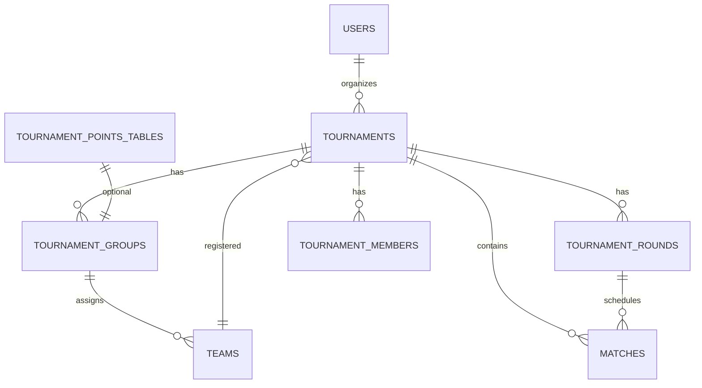

# CrickFlow — Tournament Module Architecture

**Status:** Implemented (MVP dashboard + discovery) · **Firebase:** `crickflow-b06bc`

> Extends existing `tournaments` collection and match documents. Reuses teams, players, users, scoring, and match hub.

---

## 1. Module overview

The Tournament Module is a feature-first extension under `lib/features/tournaments/` that connects to:

| Existing module | Integration |
|-----------------|-------------|
| **Users / Auth** | `organizerId`, RBAC via `tournament_members` |
| **Teams** | `teamIds` on tournament; registration from user's teams |
| **Players** | Match squads via existing match setup / scoring |
| **Matches** | `tournamentId`, `roundId`, `groupId` on `matches` |
| **Notifications** | Future: fixture reminders, registration (reuse `notifications`) |
| **Scoring** | Live matches open existing `MatchHubScreen` / scorer flow |

---

## 2. Folder structure

```
lib/
├── core/constants/enums.dart          # RoundType, TournamentRole, SponsorType, …
├── core/utils/tournament_code.dart    # ABC2026 code generation
├── data/models/
│   ├── tournament_model.dart          # Core tournament doc (+ legacy fields)
│   └── tournament/                    # Sub-entity models
├── data/repositories/
│   ├── tournament_repository.dart     # CRUD, fixtures, knockout advance
│   └── tournament_sub_repositories.dart
├── domain/services/
│   ├── fixture_generator_service.dart
│   ├── points_table_engine_service.dart
│   ├── tournament_permission_service.dart
│   └── tournament_statistics_service.dart
├── features/tournaments/presentation/
│   ├── tournament_discovery_screen.dart
│   ├── tournament_dashboard_screen.dart
│   ├── tournament_create_screen.dart
│   ├── tabs/tournament_dashboard_tabs.dart
│   └── widgets/
└── shared/providers/tournament_providers.dart
```

---

## 3. Firestore schema

### `tournaments/{tournamentId}`

| Field | Type | Notes |
|-------|------|-------|
| name, description | string | |
| bannerUrl, logoUrl | string? | Storage URLs |
| location | map | Reuses `LocationModel` |
| grounds | string[] | Venue names |
| startDate, endDate | ISO8601 | |
| organizerId, createdBy | string | Owner uid |
| format | league \| knockout \| leagueKnockout \| custom | |
| status | draft \| upcoming \| live \| completed \| cancelled | |
| teamIds, matchIds | string[] | Denormalized refs |
| pointsTable | array | Legacy + overall standings |
| bracketRounds | array | Knockout skeleton |
| tournamentCode | string | e.g. `ABC2026` |
| ballType, pitchType | string | |
| entryFee, winningPrize | number / string | |
| defaultRules | map | `TournamentRulesModel` |

### Top-level collections (scoped by `tournamentId`)

| Collection | Purpose |
|------------|---------|
| `tournament_groups` | Group A/B/C, `teamIds` |
| `tournament_rounds` | Named rounds + `RoundType` |
| `tournament_points_tables` | Per-group standings |
| `tournament_officials` | Scorer, umpire, streamer, … |
| `tournament_sponsors` | Title / associate / media |
| `tournament_rules` | Configurable rules doc |
| `tournament_members` | RBAC membership |

### Reused: `matches/{matchId}`

Additional fields: `roundId`, `groupId`, `roundName`, existing `tournamentId`, `bracketRound`, `bracketSlot`.

---

## 4. Collection relationships



---

## 5. Role permission matrix

| Action | Owner | Admin | Scorer | Viewer |
|--------|-------|-------|--------|--------|
| Full settings / delete | ✅ | — | — | — |
| Manage teams / groups | ✅ | ✅ | — | — |
| Generate fixtures | ✅ | ✅ | — | — |
| Edit rules / sponsors / officials | ✅ | ✅ | — | — |
| Score matches | ✅ | ✅ | ✅ | — |
| Read all tabs | ✅ | ✅ | ✅ | ✅ |

Implemented in `TournamentPermissionService`.

---

## 6. Fixture generation

| Mode | Service method | Output |
|------|----------------|--------|
| Round robin | `buildLeagueMatches` | All team pairs → `matches` |
| Group stage | `buildGroupStageMatches` | Round robin per group |
| Knockout | `buildKnockoutRoundOneMatches` + `buildBracketSkeleton` | Bracket + auto-advance on result |
| Manual | Future UI | Single match create with `tournamentId` |

Repository: `generateLeagueFixtures`, `generateGroupStageFixtures`, `generateKnockoutBracket`.

---

## 7. Points table engine

- **Server:** `functions/src/utils/tournament.js` updates embedded `pointsTable` on match complete.
- **Client:** `PointsTableEngineService` rebuilds standings (MP, W, L, T, NR, Pts, NRR, position).
- **Per-group:** `tournament_points_tables` documents (future sync from engine).

Sort: points DESC, NRR DESC.

---

## 8. Navigation flow

| Route | Screen |
|-------|--------|
| `/tournaments` | Discovery (6 tabs) |
| `/tournaments/create` | Create tournament |
| `/tournaments/:id` | Dashboard (11 tabs) |
| `/tournaments/:id/edit` | Edit metadata |
| `/match/:id` | Existing match hub (from Matches tab) |

Deep link: `crickflow://tournaments/{id}` · Join by code sheet on discovery.

---

## 9. Provider architecture

| Provider | Type | Purpose |
|----------|------|---------|
| `tournamentsProvider` | Stream | All tournaments (existing) |
| `tournamentProvider` | Stream.family | Single tournament |
| `tournamentMatchesProvider` | Stream.family | Matches for tournament |
| `tournamentGroupsProvider` | Stream.family | Groups |
| `tournamentMemberRoleProvider` | Provider.family | Resolved RBAC role |
| `filteredTournamentsProvider` | Provider.family | Discovery tab filter |

---

## 10. Scalability recommendations

1. **Cloud Functions:** Move fixture batch writes + standings to callable functions for large tournaments.
2. **Indexes:** Deploy composite index on `tournaments.tournamentCode` (equality).
3. **Subcollections:** Consider nesting `groups/` under `tournaments/{id}` if query patterns stay tournament-scoped.
4. **Security rules:** Tighten `tournament_members` writes to owner/admin only (currently signed-in MVP).
5. **Caching:** Dashboard tabs already use Riverpod stream caching; add `keepAlive` for active tournament id.
6. **Media:** Banner/logo upload via existing `StorageService` (Settings tab follow-up).

---

## 11. Integration checklist

- [x] Extend `TournamentModel` (backward compatible)
- [x] Discovery + dashboard UI (CrickFlow theme)
- [x] Team registration (existing teams)
- [x] Fixture generation (league, groups, knockout)
- [x] Points table (embedded + client engine)
- [x] Rules, officials, sponsors CRUD
- [x] Tournament code + share sheet
- [x] RBAC models + permission service
- [ ] Group ↔ team assignment UI (assign from teams list)
- [ ] Manual fixture editor
- [ ] Cloud Function per-group standings
- [ ] Tournament notifications
